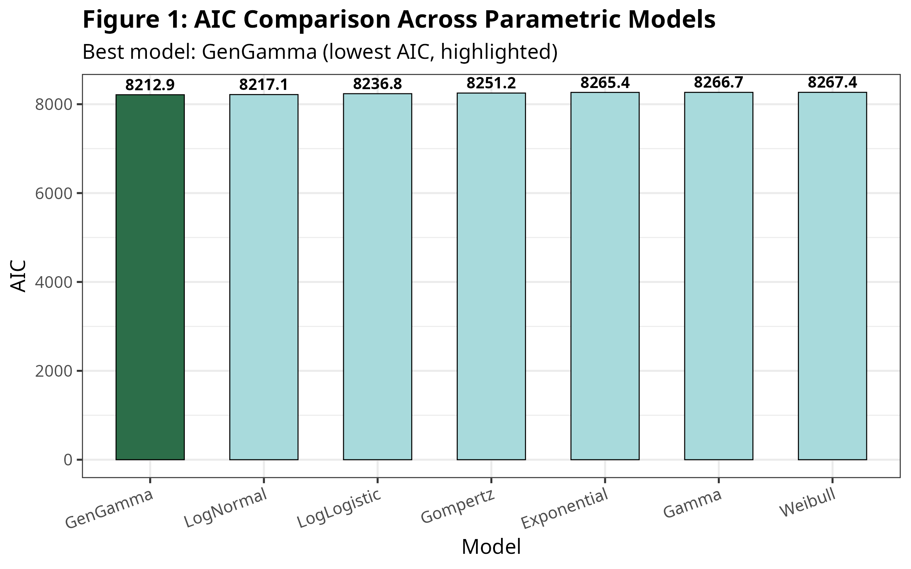
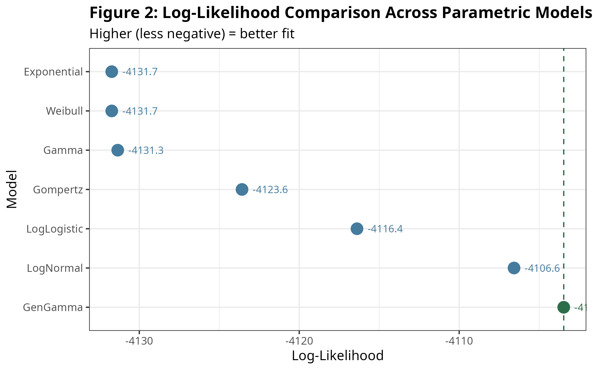
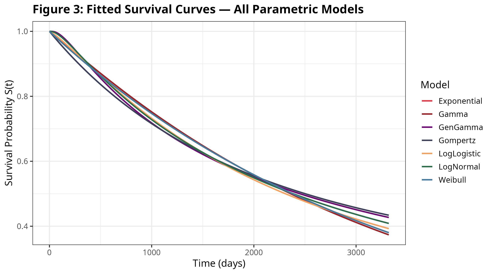
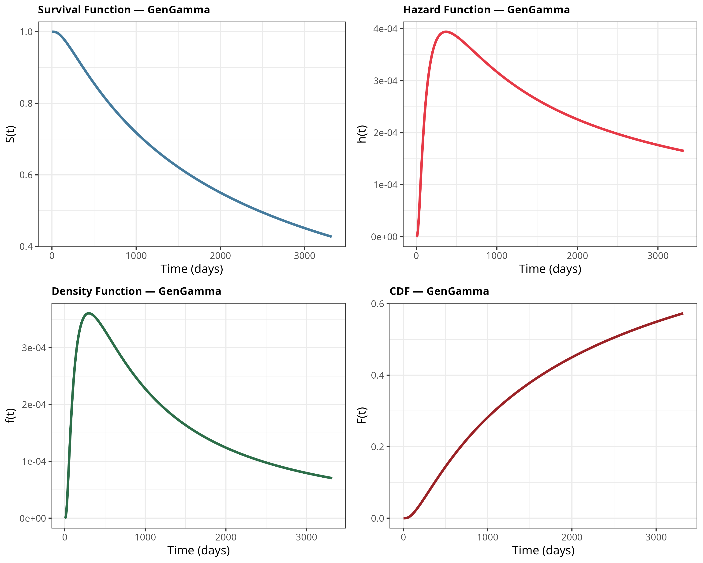

# Parametric Survival Analysis — Group 2


---


## Overview

This project applies **parametric survival analysis** to the colon cancer dataset
from the North Central Cancer Treatment Group (NCCTG) study, available in the R
`survival` package. We fit seven parametric survival distributions, compare them
using the Akaike Information Criterion (AIC), and interpret the life functions of
the best-fitting model to understand survival patterns in colon cancer patients.

---

## Group Members & Contributions

| Member | Script | Contribution |
|--------|--------|-------------|
| **Tchandikou Ouadja Fare** | `01_data_cleaning.R` | Data loading, LOCF imputation, survival object,README |
| **Rabecca Kanini Kating'u** | `02_summary_tables.R` | Descriptive statistics, Tables 1 & 2, Beamer |
| **Joshua Pius Opio** | `03_model_fitting.R` | Model fitting, Table 3, Figures 1–3, Beamer |
| **Djadida Uwituze** | `04_life_functions.R` | Life functions, Tables 4–5, Figure 4 |
| **Josiane Kazanenda** | `05_interpretation.R` | MLE Table 6, interpretation, Beamer  |

---

## Dataset

| Item | Details |
|------|---------|
| **Name** | Colon Cancer (`colon`) |
| **Source** | `survival` R package — NCCTG study |
| **Event of interest** | Death (`etype == 2`) |
| **Total patients** | 929 |
| **Events (deaths)** | 452 (48.7%) |
| **Censored** | 477 (51.3%) |
| **Follow-up range** | 23 — 3,329 days |
| **Mean follow-up** | 1,670 days |
| **Median follow-up** | 1,976 days |

### Key Variables

| Variable | Description | Range |
|----------|-------------|-------|
| `time` | Survival/follow-up time in days | 23 – 3,329 |
| `status` | Event indicator (0 = censored, 1 = death) | 0 / 1 |
| `age` | Patient age at baseline (years) | 18 – 85 |
| `sex` | Patient sex (0 = female, 1 = male) | 0 / 1 |
| `nodes` | Number of positive lymph nodes | 0 – 33 |

> **Note:** The `nodes` variable had 18 missing values (<2%).
> These were imputed using **Last Observation Carried Forward (LOCF)**
> before analysis.

---

## Objectives

1. Explore and summarise the colon cancer survival dataset
2. Handle missing values appropriately using LOCF imputation
3. Fit seven parametric survival models to the data
4. Select the best model using AIC
5. Compute and interpret the life functions of the best model
6. Draw clinical insights from the survival patterns observed

---

## Methods

- **Missing data:** Last Observation Carried Forward (LOCF) for `nodes` (<2% missing)
- **Survival object:** Created using `Surv(time, status)` from the `survival` package
- **Models fitted:** Exponential, Weibull, Log-Normal, Log-Logistic, Gamma,
  Generalised Gamma, Gompertz
- **Model fitting:** Maximum Likelihood Estimation via `flexsurvreg()` (`flexsurv` package)
- **Model selection:** Akaike Information Criterion (AIC) — lower is better
- **Life functions computed:** S(t), h(t), f(t), F(t), mean survival, variance

---

## Key Results

### Model Comparison

| Model | Log-Likelihood | AIC | BIC |
|-------|---------------|-----|-----|
| **Generalised Gamma**  | **-4103.5** | **8212.9** | 8227.4 |
| Log-Normal | -4106.6 | 8217.1 | 8226.8 |
| Log-Logistic | -4116.4 | 8236.8 | 8246.4 |
| Gompertz | -4123.6 | 8251.2 | 8260.8 |
| Exponential | -4131.7 | 8265.4 | 8270.3 |
| Gamma | -4131.3 | 8266.7 | 8276.4 |
| Weibull | -4131.7 | 8267.4 | 8277.1 |

 **Best model: Generalised Gamma** (lowest AIC = 8,212.9)

### Best Model Parameters

| Parameter | Estimate | SE | 95% CI |
|-----------|----------|----|--------|
| μ (mu) | 7.545 | 0.117 | [7.317, 7.774] |
| σ (sigma) | 1.575 | 0.073 | [1.438, 1.725] |
| Q | -0.481 | 0.191 | [-0.855, -0.106] |

### Survival Summary

| Statistic | Value |
|-----------|-------|
| Mean survival time | 2,130 days **(5.84 years)** |
| Standard deviation | 1,221 days |
| Variance | 1,491,722 days² |
| Median survival (est.) | ~1,900 days (~5.2 years) |

### Interpretation

- **Q = -0.481 < 0** — the hazard is **non-monotone**: it rises steeply in the
  first ~300 days after diagnosis, then gradually declines. This pattern is
  clinically consistent with post-surgical risk followed by stabilisation.
- **90%** of patients survive beyond 1 year; approximately **55%** survive
  beyond 5 years.
- **50%** of patients die within approximately 2,500 days (~6.8 years).
- The high standard deviation (1,221 days) reflects substantial
  heterogeneity in patient outcomes.

---

## Figures

### Figure 1 — AIC Comparison


### Figure 2 — Log-Likelihood Comparison


### Figure 3 — Fitted Survival Curves (All Models)


### Figure 4 — Life Functions of the Best Model


---

## Project Structure

```
Survival-Analysis-Group2/
│
├── data/
│   └── colon_clean.csv               # Cleaned dataset after LOCF imputation
│
├── scripts/
│   ├── 01_data_cleaning.R            # Tchandikou — data loading & LOCF
│   ├── 02_summary_tables.R           # Rabecca   — Tables 1 & 2
│   ├── 03_model_fitting.R            # Joshua    — model fitting, Figures 1–3
│   ├── 04_life_functions.R           # Djadida   — life functions, Figure 4
│   ├── 05_interpretation.R           # Josiane   — Table 6 & interpretation
│   └── Group_2_SA1.R                 # Full combined pipeline (run all at once)
│
├── outputs/
│   ├── figures/
│   │   ├── Figure1_AIC_Comparison.png
│   │   ├── Figure2_LogLikelihood_Comparison.png
│   │   ├── Figure3_Survival_Curves_AllModels.png
│   │   └── Figure4_LifeFunctions_BestModel.png
│   └── tables/
│       ├── Table1_Variable_Summary.csv / .html
│       ├── Table2_Sample_Summary.csv / .html
│       ├── Table3_Model_Comparison.csv / .html
│       ├── Table4_Life_Functions.csv / .html
│       ├── Table5_Mean_Variance.csv / .html
│       └── Table6_MLE_Parameters.csv / .html
│
├── presentation/
│   └── Group2_Presentation.tex       # Beamer slides (LaTeX)
│
└── README.md
```

---

## How to Run ?

### A — Full pipeline (one script)

```r
source("scripts/Group_2_SA1.R")
```

This runs everything end-to-end and saves all figures and tables to `outputs/`.

### B — Step by step

> Run script 01 first — all other scripts depend on `data/colon_clean.csv`

```r
source("scripts/01_data_cleaning.R")   # creates data/colon_clean.csv
source("scripts/02_summary_tables.R")  # Tables 1 & 2
source("scripts/03_model_fitting.R")   # Table 3, Figures 1-3
source("scripts/04_life_functions.R")  # Tables 4-5, Figure 4
source("scripts/05_interpretation.R")  # Table 6, interpretation
```

---

## Required R Packages

```r
install.packages(c(
  "survival",    # colon dataset and Surv()
  "flexsurv",    # parametric model fitting
  "dplyr",       # data manipulation
  "ggplot2",     # plotting
  "gridExtra",   # 2x2 plot grid
  "knitr",       # table formatting
  "kableExtra"   # styled HTML tables
))
```

## License

This project is submitted as part of the AIMS Survival Analysis course.
For academic use only.

---

*African Institute for Mathematical Sciences (AIMS) — 2026*
